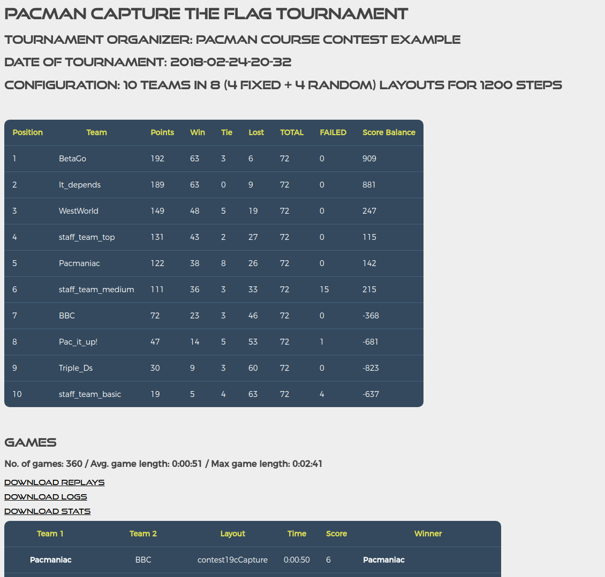

# PACMAN CAPTURE THE FLAG - CONTEST SUPPORT SCRIPT #

This system allows to run complex contests for the UC Berkley Pacman Conquer the Flag game (http://ai.berkeley.edu/contest.html).

Designed & developed for RMIT COSC1125/1127 AI course in 2017 by lecturer A/Prof. Sebastian Sardina (with programming support by Marco Tamassia), 
based on an original script from Dr. Nir Lipovetzky. Since then, the tool has been continously improved and extended to fit RMIT COSC1125/1127 and UNIMELB COMP90054 AI course.

**CONTACT:** A/Prof. Sebastian Sardina (ssardina@gmail.com) and Dr. Nir Lipovetzky (nirlipo@gmail.com)

----------------------

## OVERVIEW ##

This system allows to run a full Pacman Capture the Flag tournament among many teams using a cluster of machines. 
This means that it allows to run many games at the same time, depending how many total cpu cores are available.

The system takes the set of teams, set of workers in a cluster, and tournament configuration (which layouts and how many steps per game), 
runs games for every pair of teams and layouts (round-robin type of tournament), and produces files and html web page with the results.

The system contains two main scripts:

1. ```pacman-ssh-contest.py``` is the main script to actually run a contest.
2. ```pacman_html_generator.py``` generates an HTML web page from existing data of already ran contests.


To see options available run: 
```
python pacman-ssh-contest.py --help
```

```
python pacman_html_generator.py --help
```


### Features ###

* Cluster support to run many games at the same time.
    * option `--workers-file <json file>`
    * connection via ssh with tunneling support if needed.
* Can use variable number of fixed layouts and randomly generated layouts.
    * options `--no-fixed-layouts` and `--no-random-layouts `
* Flexible configuration via many command line options.
* Map individual student submissions to teams.
    * Via student-team mapping file; option `--team-names`
    * Mapping each filename.zip submission as teamname=filename; option `--ignore-file-name-format`
* Generate HTML page with tournament results and list of replay files.
    * ability to store replays and logs into https://transfer.sh to avoid filling your local www space
    * Ranking generation:
        * 3 points per win; 1 point per tie. Failed games are loses.
        * Order by: points first, no. of wins second, score points third.
* Handle latest submission by sorting via timestamp in file name.
    * all members of a team can submit at any point
    * last submission per team is considered (if there are multiple)
    * this is done by mapping individual submission to a team via `--team-names-file` and timestamp in zip submission file
* Automate tournament using a `driver.py` script and `cron`
    
    
## PRE-REQUISITES ##


### Software requirements in cluster and local machines

* In **each machine in the cluster**:
    * unzip & zip (to pack and unpack submissions and files for transfer)
        * `sudo apt-get install -y unzip zip vim`
    * Python >=2.7 with standard libraries (the UC Pacman Contest runs under Python 2 version, not 3).
    * Set the sshd server to accept as many connections as you want to run concurrently. This is done by changing option `MaxStartups` in file `/etc/ssh/sshd_config`. By default sshd has up to 10 connections.
        * For example, set `MaxStartups 20:30:60` to accept up to 20 simultaneous connections. Remember to restart the ssh server: `sudo service sshd restart`
        * For more info on this, see issue #22.
    * Cluster should have all the Python and Unix packages to run the contest. For example, in the NeCTAR cluster:
                            
            sudo apt-get update
            sudo apt-get install python3-pip unzip vim
            sudo pip3 install setuptools
            sudo pip3 install -r requirements.txt
                    
        If you do not have root access you can use `pip install -r requirements.txt --user` to do a user install. Get [requirements.txt](requirements.txt) with wget.

    * Many students benefit from the availability other tools, like [TensorFlow](https://www.tensorflow.org/), [scikit-learn](http://scikit-learn.org/), [neat-python](https://github.com/CodeReclaimers/neat-python): 
        * `pip install tensorflow sklearn sklearn scipy neat-python --user` or `sudo pip install tensorflow sklearn scipy neat-python`
    * If students want to use planners to solve pacman PDDL models for their solutions, copy any planner to `/usr/local/bin`. For example, in the NeCTAR cluster:
         
            sudo cp planners/ff /usr/local/bin/.
        

* In the **local machine** that will dispatch jobs to the cluster via `pacman-ssh-contest.py` script:
    * unzip & zip (to pack and unpack submissions and files for transfer): `sudo apt-get install -y unzip zip`
    * Python >= 3.5 with:
           * setuptools
           * python-future
           * future
           * iso8601
           * pytz
           * paramiko
    * Simply run: `pip install -r requirements.txt --user`
        * Observe we use pip (Python 2.7+) because the server will run the actual Pacman capture.py script (which uses Python 2.7)


In addition to that:

* Each submission is a .zip file or a directory; they should all go in a directory (e.g., teams/)
    * The agent system is in the root of the team zip file or team directory.
    * The name convention of a submission file/dir will depend on `--team-names-file` option.
    
* If option `--team-names-file` is passed, then submission file/dir names will be treated as student number and will be
mapped to team names using mapping .csv file provided. Otherwise submission file/dir name will be used as team name. 
    * zip/dir should start with "s", continue with student number, then _, and then date in iso8601 format 
        (https://en.wikipedia.org/wiki/ISO_8601), then .zip
    * Format stored regexp SUBMISSION_FILENAME_PATTERN: r'^(s\d+)_(.+)?\.zip$'
    * Examples of legal team zip files:
        - s2736172_2017-05-13T21:32:43.342000+10:00
        - s2736172_2017-05-13.zip
    * Examples of team directories:
        - Destructor_Pacman-05-13T21:32:43.342000+10:00
        - WeWillWin-05-13
    * The student number will be mapped to a team and the timestamp will be used to pick the latest team submission.

* The cluster to be used is specified with option `--workers-file-path`, to point to a `.json` file containing the workers available (including no of cores, IP, username, password, and private key file if needed)

Hence, user must provide:

- *private keys* for cluster (if needed; specified in workers.json)
- Directory with set of zip submission files; see above (for option `--teams`)
- `workers.json`: listing the cluster setting to be used (for option `--workers-file-path`)
- TEAMS-STUDENT-MAPPING.csv [optional]: a csv mapping submissions to teams (for option `--team-names-file`)
    - Main columns are: STUDENT_ID and TEAM_NAME
    - If **no file provided**, teamnames are taken from the submitted zip files (this is the option used at unimelb)


## HOW THE SCRIPT WORKS ##


### Main components ###

- `driver.py`: downloads teams from submissions server, runs `pacman-ssh-contest.py` and upload results into the web.
- `pacman-ssh-contest.py`: main script
- `cluster_manager.py`: the script to manage clusters
- `contest.zip`: the actual main contest infrastructure, based on that one from UC (with minor fixes, e.g., delay in replays)
- `layouts.zip`: some interesting layouts that can be used (beyond the randomly generated ones)
- `staff_team_{basic,medium,top}.zip`: the teams from staff, used for `--include-staff-team` option. 
    - You can point to the directory containing all three staff agents using `--staff-teams-dir` (default is current dir)
	- You can use your own basic, medium, top agents, as long as they are named accordingly.  
	- If you want to use our agents, co ntact us. These teams are not shared as they are used for marking purposes. So, if
	    you get access to them, please do not distribute.
- `contest/` subdir: developing place for `contest.zip`. The .zip file should contain all files in the root of the .zip
- `TEAMS-STUDENT-MAPPING.csv`: example of a mapping file


### Overview of marking process ###

1. The script authenticate to all workers.
2. Then the script will collect all the teams. 
- If option **--ignore-file-name-format** is given, then it will simply collect the teamnames from the <teamname>.zip files, otherwise:
    - Will collect each file with pattern s<student number>_<timestamp>.zip
    - If student number is not registered in any team as per mapping given by _--team-names-file_ then the file is 
    ignored (we do not know which team it corresponds) and the following message is issued:
        ````
        Sun, 24 Sep 2017 15:25:48 WARNING  Student not registered: "s123456" (file test-teams/s123456_2017-05-15). Skipping
        ````
    - If student is found in a team but submission has wrong timestamp, then it is also ignored as we cannot know if it 
    is the latest submission for the team. A message is issued:
        ````
        Sun, 24 Sep 2017 15:25:48 WARNING  Team zip file "test-teams/s5433273" name has invalid date format. Skipping
        ````
3. The script will _use contest.zip_, _layouts.zip_ (where some fixed layouts are stored) and a set of teams and:
    1. create a temporary full contest dir `contest-tmp`
    2. zip it into `contest_and_teams.zip` file
3. For each game:
    1. transfer  _contest_and_teams.zip_ to an available worker
    2. expanded in `/tmp/cluster_xxxxxxx`
    3. run game
    4. copy back log and replay to marking machine. 
    


### Example run ###

Using a csv file to specify team names, include staff teams:
````
python pacman-ssh-contest.py --compress-log \
        --organizer "RMIT COSC1125/1127 - Intro to AI" \
        --teams-root AI17-contest/teams/  \
        --team-names-file AI17-contest/AI17-Contest-TEAMS.csv  \
        --www-dir www/ \
        --max-steps 1200 \
        --no-fixed-layouts 5 --no-random-layouts 10 \
        --workers-file AI1-contest/workers/nectar-workers.jason  
        --staff-teams-dir AI17-contest/staff-teams/
````
Collecting submitted files in teams, and using the zip filename as teamname, and uploading the replays file only into a sharing file service instead of your local directory:
````
python pacman-ssh-contest.py --compress-log \
        --organizer "UoM COMP90054/2018 - AI Planning" \
        --teams-root AI17-contest/teams/  \
        --www-dir www/ \
        --max-steps 1200 \
        --no-fixed-layouts 5 --no-random-layouts 10 \
        --workers-file AI1-contest/workers/nectar-workers.jason  
        --staff-teams-dir AI17-contest/staff-teams/
        --upload-www-replays
````


### Example reusing a partial run to resume a tournament ###

It is possible to **resume an existing failed/partial competition** or **repeat a specific competition** by using the option `--resume-competition-folder`.

So, if a run fails and is incomplete, all the logs generated so far can be found in the folder ``tmp\logs-run`` in your the local machine cloned repo.

To resume the competition (so that all games played are used and not re-played):

1. Copy the temporal files into a different temporal folder: `mv tmp tmp-failed`
2. Tell the script to use that folder to get the existing logs by appending `--resume-competition-folder tmp-failed/`
3. Tell the script which are all the layouts to be used (those that were originally used in the failed run):
    * Use  `--fixed-layout-seeds` followed by the names of all fixed layouts that are to be used, separated by commas. 
        * E.g., `--fixed-layout-seeds contest05Capture,contest16Capture,contest20Capture`
    * Use `--random-seeds` followed by the seed numbers of all random layouts that are to be used, separated by commas.
        * E.g., `--random-seeds 7669,1332`

The `--fixed-layout-seeds` and `--random-seeds` options are also useful if you want to force the script to use some specific layouts. 
Look in folde folder [contest/layouts/](https://bitbucket.org/ssardina-teaching/pacman-contest/src/master/contest/layouts/) for available fixed layouts.


Note that if the seeds given are less than the number of layouts asked for, the remaining are completed randomly.

The seeds for the fixed and random layouts used at each tournament are printed at the start, so one can recover them. 
However, if you need to recover the layouts played in the `tmp/` subdirectory, you can get them as follows:

1. For the random seeds: `ls -la tmp/logs-run/ |  grep RANDOM | sed -e "s/.*RANDOM\(.*\)\.log/\1\,/g" | sort -u | xargs -n 100`
2. For the fixed layouts: `ls -la tmp/logs-run/ |  grep -v RANDOM | grep log | sed -e "s/.*_\(.*\)\.log/\1\,/g" | sort -u | xargs -n 100`


### Example re-running only 1 team in a given competition ###


If only 1 team or a subset of teams failed, you can load the new code of the team, remove all the logs from the temporal folder, and re-run the competition using the same method commeted above. It will only run the games for the logs you deleted.


### Example generating web page from statistics ###

Build web page in www/ from stats, replays, and logs dirs:
````
python pacman_html_generator.py --organizer "Inter Uni RMIT-Mel Uni Contest" \
    --www-dir www/ \
    --stats-archive-dir stats-archive/  \
    --replays-archive-dir replays-archive/ \ 
    --logs-archive-dir logs-archive/
````

or if all stats, replays, and logs are within <www-dir> then just:

````
python pacman_html_generator.py --organizer "Inter Uni RMIT-Mel Uni Contest" --www-dir www/
````

**Observation:** If the stats file for a run has the transfer.sh URL for logs/replays, those will be used.

## SCHEDULE COMPETITION ##


If you want to automate the tournament, use the `driver.py` provided. It has the following options:

```
  --username [USERNAME]
                        username for --teams-server-url or for https git connection
  --password [PASSWORD]
                        password for --teams-server-url or for https git connection
  --dest-www [DEST_WWW]
                        Destination folder to publish www data in a web
                        server. (it is recommended to map a web-server folder
                        using smb)
  --teams-server-folder [TEAMS_SERVER_FOLDER]
                        folder containing all the teams submitted at the
                        server specified at --teams-server-name
  --teams-server-url [TEAMS_SERVER_URL]
                        server address containing the teams submitted
  --teams-git-csv [TEAMS_GIT_CSV] 
                        CSV containining columns TEAM, 'GitLab SSH repository link' and 'GitLab https repository link' 
  --tournament-cmd [TOURNAMENT_CMD]
                        specify all the options to run pacman-ssh-contesy.py
  --cron-script-folder [CRON_SCRIPT_FOLDER]
                        specify the folder to the scripts in order to run cron
```

You can run a competition using the following command:

```
 driver.py --dest-www '' --teams-git-csv xxx --tournament-cmd '--compress-log --organizer "UoM COMP90054/2018 - AI Planning" ...'
```

It uses a csv file with the links to github/bitbucket/gitlab or any git server containing the code of each team, and downloads the submissions that have the *tag submission-contest* (see [driver.py](https://bitbucket.org/ssardina-teaching/pacman-contest/src/634025cf462dfb379f9f9c96c9b87d7be9c0577d/driver.py#lines-37)).

#### Test command to schedule ####

We strongly recommend to test the command you want to schedule in **cron**

Run the following command:
```
crontab -e
```

and introduce the following line into **cronfile** (change *username* appropriately)

```
# For more information see the manual pages of crontab(5) and cron(8)
# 
# m h  dom mon dow   command

* * * * *  /usr/bin/env > /home/username/cron-env
```

Now you can test the command you want to schedule by running
```
./run-as-cron /home/username/cron-env "<command>"
```

This will run you command with the same environment settings as cron jobs do. If the command succeeds, then you can set up your command now.

#### Setting up cron ####

Run the following command:
```
crontab -e
```
Remove the line you introduced before and introduce the following line:
```
# For more information see the manual pages of crontab(5) and cron(8)
# 
# m h  dom mon dow   command

01 00 * * * python driver.py --username xxx --password xxx --cron-script-folder ''  --dest-www '' --teams-server-folder '' --teams-server-url xxx --tournament-cmd ''
```

Now your script will run every midnight at 00:01


## TROUBLESHOOTING 

* Cannot connect all hosts with message: _"Exception: Error reading SSH protocol banner"_
    * This happens when a single host has more than 10 CPUs.
    * The problem is not the script, but the ssh server in the cluster. By default it does not accept more than 10 connections. 
    * Configure `/etc/ssh/sshd_config:` in the host with `MaxStartups 20:30:60`
    * Check [this issue](https://bitbucket.org/rmitteaching/pacman-contest/issues/22/ssh-problems-with-10-cluster-machines)


## LICENSE

This project is using the GPLv3 for open source licensing for information and the license visit GNU website (https://www.gnu.org/licenses/gpl-3.0.en.html).

This program is free software: you can redistribute it and/or modify it under the terms of the GNU General Public License as published by the Free Software Foundation, either version 3 of the License, or (at your option) any later version.

This program is distributed in the hope that it will be useful, but WITHOUT ANY WARRANTY; without even the implied warranty of MERCHANTABILITY or FITNESS FOR A PARTICULAR PURPOSE. See the GNU General Public License for more details.

You should have received a copy of the GNU General Public License along with this program. If not, see http://www.gnu.org/licenses/.

## SCREENSHOT

